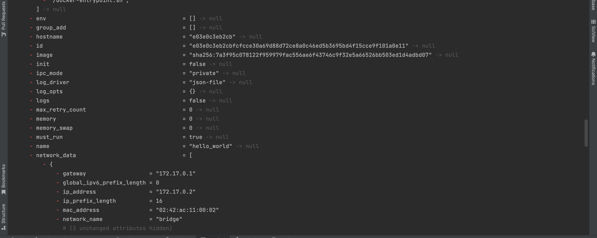

### Задание 0
1. Скачайте и установите **Terraform** версии >=1.8.4 . Приложите скриншот вывода команды ```terraform --version```.
<br><br>

2. Скачайте на свой ПК этот git-репозиторий. Исходный код для выполнения задания расположен в директории **01/src**.
<br><br>
Ссылка на склонированный репозиторий [тут](https://github.com/VikhlyantsevA/ter-homeworks).
3. Убедитесь, что в вашей ОС установлен docker.
<br><br>


### Задание 1
<br><br>
*Код в папке ter-homeworks/01/src_1*

1. Скачайте все необходимые зависимости, использованные в проекте. 
<br><br>
Скачивание всех зависимостей.


<br><br>
Добавление в `.terraform.lock.hcl` хэшей для зависимостей для linux операционной системы (у меня MacOS):

2. Изучите файл **.gitignore**. В каком terraform-файле, согласно этому .gitignore, допустимо сохранить личную, секретную информацию?(логины,пароли,ключи,токены итд)
<br><br>
В `personal.auto.tfvars`.
3. Выполните код проекта. Найдите  в state-файле секретное содержимое созданного ресурса **random_password**, пришлите в качестве ответа конкретный ключ и его значение.
<br><br>
Сгенерированный пароль:

4. Раскомментируйте блок кода, примерно расположенный на строчках 29–42 файла **main.tf**. Выполните команду ```terraform validate```. Объясните, в чём заключаются намеренно допущенные ошибки. Исправьте их.
<br><br>
Скрин `terraform validate`:

<br><br>
   - У ресурса `docker_image` не хватает 2-го lable - `name`.
   - У ресурса `docker_container` некорректный lable `name`. Имя не должно начинаться с цифры.
   - Судя по идентификатору `image` ресурса `docker_container` у ресурса `docker_image` должно быть имя `nginx`.
   - Ресурса с лейблом `random_string_FAKE` нет. Есть ресурс типа `random_password` с лейблом `random_string`.
   - Опечатка в `resulT` при считывании сгенерированного пароля.
   - В блок провайдера `docker` нужно добавить идентификатор `host = "unix:///Users/mac/.docker/run/docker.sock"`
5. Выполните код. В качестве ответа приложите: исправленный фрагмент кода и вывод команды ```docker ps```.
<br><br>
Вывод `docker ps` после запуска исправленной конфигуации terraform.

6. Замените имя docker-контейнера в блоке кода на ```hello_world```. Не перепутайте имя контейнера и имя образа. Мы всё ещё продолжаем использовать name = "nginx:latest". Выполните команду ```terraform apply -auto-approve```.
Объясните своими словами, в чём может быть опасность применения ключа  ```-auto-approve```. Догадайтесь или нагуглите зачем может пригодиться данный ключ? В качестве ответа дополнительно приложите вывод команды ```docker ps```.
<br><br>
Вывод docker ps:

<br><br>
Возможно `-auto-approve` может быть полезен для автоматизации развертки инфраструктуры, например через ci/cd пайплайны. 
Согласно документации рекомендуют убедиться что при использовании `-auto-approve` никто за пределами рабочих процессов terraform не может изменять инфраструктуру (наверное имеются ввиду ручные изменения). В противном случае это может привести к непредсказуемым результатам и дрейфу конфигураций. Однако примеры непредсказуемых результатов и дрейфа конфигураций я не нашел. 
Также `-auto-approve` может быть опасен тем, что могут быть применены настройки, приводящие к удалению ресурсов.
7. Уничтожьте созданные ресурсы с помощью **terraform**. Убедитесь, что все ресурсы удалены. Приложите содержимое файла **terraform.tfstate**. 
<br><br>
Уничтожение созданных ресурсов:

<br><br>

<br><br>
Результат `terraform destroy`:
```
{
  "version": 4,
  "terraform_version": "1.9.8",
  "serial": 19,
  "lineage": "25f6e057-4c8d-4a1d-a751-ce826f5d6e4b",
  "outputs": {},
  "resources": [],
  "check_results": null
}
```
8. Объясните, почему при этом не был удалён docker-образ **nginx:latest**. Ответ **ОБЯЗАТЕЛЬНО НАЙДИТЕ В ПРЕДОСТАВЛЕННОМ КОДЕ**, а затем **ОБЯЗАТЕЛЬНО ПОДКРЕПИТЕ** строчкой из документации [**terraform провайдера docker**](https://docs.comcloud.xyz/providers/kreuzwerker/docker/latest/docs).  (ищите в классификаторе resource docker_image )
<br><br>
Среди идентификаторов ресурса `docker_image` есть `force_remove`. Он отвечает за принудительное удаление образа при удалении ресурсов terraform.
Описание из документации:


### Задание 2*
1. Создайте в облаке ВМ. Сделайте это через web-консоль, чтобы не слить по незнанию токен от облака в github(это тема следующей лекции). Если хотите - попробуйте сделать это через terraform, прочитав документацию yandex cloud. Используйте файл personal.auto.tfvars и гитигнор или иной, безопасный способ передачи токена!
<br><br>
ВМ была создана по [инструкции](https://yandex.cloud/en/docs/tutorials/infrastructure-management/terraform-quickstart?utm_referrer=about%3Ablank) и по документации провайдера [yandex-cloud](https://registry.terraform.io/providers/yandex-cloud/yandex/latest/docs/resources/compute_instance).
Чувствительная информация вместе с токеном были экспортированы в переменные окружения:
```bash
export YC_TOKEN=$(yc iam create-token)
export YC_CLOUD_ID=$(yc config get cloud-id)
export YC_FOLDER_ID=$(yc config get folder-id)
```
Код для создания ВМ в YC с terraform находится в папке в `ter-homeworks/01/yc_vm_create`.
<br><br>
**!!!!Не понял как выбирать тип процессора, например Intel Ice Lake, а также выбирать Прерываемую виртуальную машину**
<br><br>
**!!!!Не понял как сделать чтобы работало подключение по ssh. По образцам из документации YC ничего не работает.**
<br><br>
**!!!!Как сделать ip адрес статическим, а не динамическим через ключи в провайдере?**
<br><br>
Результат создания ВМ с помощью terraform:

<br><br>
**!!!!PS: В результате применения конфигураций terraform часто возникала на разных этапах нижеприведенная ошибка. При повторном запуске `terraform apply` она могла пропасть или возникнуть в ином месте. Возникала почти моментально. Для создания виртуальной машины пришлось применять `apply` раз 20. Гугление не помогло решить проблему. На данный момент актуальная версия yandex провайдера 0.134. Опустился до версии 0.122 (релиз 6 мес назад). Все четко сработало. Может порекомендуете что-то еще?**

<br><br>
2. Подключитесь к ВМ по ssh и установите стек docker.
<br><br>
3. Найдите в документации docker provider способ настроить подключение terraform на вашей рабочей станции к remote docker context вашей ВМ через ssh.
<br><br>
4. Используя terraform и remote docker context, скачайте и запустите на вашей ВМ контейнер mysql:8 на порту 127.0.0.1:3306, передайте ENV-переменные. Сгенерируйте разные пароли через random_password и передайте их в контейнер, используя интерполяцию из примера с nginx.(name = "example_${random_password.random_string.result}" , двойные кавычки и фигурные скобки обязательны!)
 ```
environment:
   - "MYSQL_ROOT_PASSWORD=${...}"
   - MYSQL_DATABASE=wordpress
   - MYSQL_USER=wordpress
   - "MYSQL_PASSWORD=${...}"
   - MYSQL_ROOT_HOST="%"
```
Код в папке `ter-homeworks/01/src_2`
<br><br>
5. Зайдите на вашу ВМ , подключитесь к контейнеру и проверьте наличие секретных env-переменных с помощью команды env. Запишите ваш финальный код в репозиторий.
